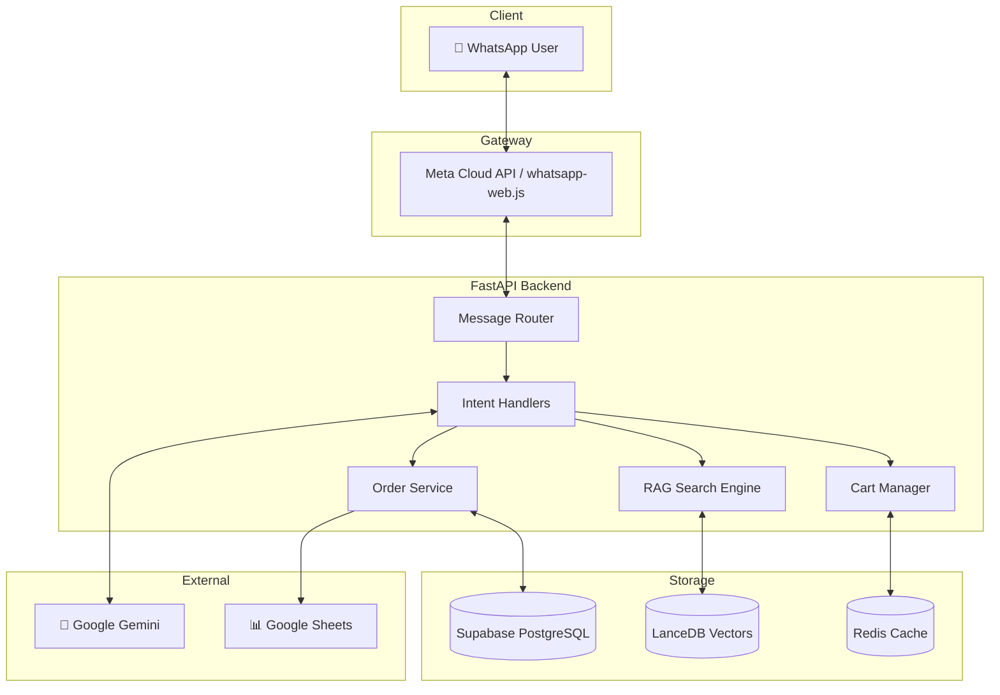

<div align="center">

# 🛒 SmartShop WhatsApp Bot

### AI-Powered WhatsApp E-Commerce Assistant

[](https://www.python.org/downloads/)
[](https://fastapi.tiangolo.com/)
[](https://www.docker.com/)
[](https://redis.io/)
[](https://streamlit.io/)
[](https://supabase.com/)
[](https://ai.google.dev/)
[](https://lancedb.com/)
[](LICENSE)

**Autonomous Sales Agent • RAG-Powered Search • Self-Healing Operations**

[Quick Start](#-quick-start) •
[Features](#-features) •
[Architecture](#-architecture) •
[Documentation](#-documentation) •
[Demo](#-demo)

</div>

---

## 🎯 What is SmartShop?

SmartShop is a **production-ready WhatsApp commerce bot** that acts as an autonomous sales agent. It uses **Retrieval-Augmented Generation (RAG)** to understand natural language queries, manage shopping carts, process orders, and seamlessly hand off to human agents when needed.

```
User: "Show me laptops under 80000"
Bot:  📱 Found 3 laptops for you:
      1. MacBook Air M2 - ₹79,999
      2. Dell XPS 13 - ₹74,500
      3. HP Pavilion - ₹65,000

      Reply with number to add to cart!
```

---

## ✨ Features

### 🔍 Intelligent Product Search (RAG)

- **Semantic Search**: Understands "phones with good camera" → finds camera-focused phones
- **Hybrid Search**: Combines vector similarity + keyword matching
- **Price Filtering**: "laptops under 50000" works out of the box

### 🛒 Complete Cart Management

- Add, remove, update quantities
- Persistent cart across sessions
- **Atomic Stock Management**: Race-condition safe inventory

### 💳 Order & Payment Flow

- Multi-step checkout with address collection
- **Smart Checkout**: Returning users skip address entry
- Manual UPI payment confirmation
- **Google Sheets Sync**: Real-time order logging

### 🧠 AI-Powered Responses

- Google Gemini for natural conversations
- Context-aware product recommendations
- "You might also like..." cross-selling

### 👨‍💻 Human Handoff

- User says "support" → AI pauses
- Messages forwarded to human agent
- User says "resume AI" → Bot resumes

### 📊 Analytics & Recovery

- Funnel tracking (Search → Cart → Order)
- **Abandoned Cart Recovery**: Auto-reminders after 30 mins
- Conversion analytics

### 🛡️ Production-Ready

- **Rate Limiting**: Per-user throttling
- **Idempotency**: No duplicate orders
- **Error Recovery**: Graceful degradation
- **Kill Switch**: Disable AI instantly

---

## 🏗️ Architecture



### Tech Stack Decisions

| Component            | Choice                | Why                                                           |
| -------------------- | --------------------- | ------------------------------------------------------------- |
| **API Framework**    | FastAPI               | Async-first, auto OpenAPI docs, Pydantic validation           |
| **Vector Database**  | LanceDB               | Zero-config, embedded, 10x faster than Pinecone for our scale |
| **Primary Database** | Supabase              | Managed Postgres, real-time, Row Level Security               |
| **Cache/Sessions**   | Redis                 | Atomic operations, pub/sub for real-time                      |
| **LLM**              | Google Gemini         | Cost-effective, fast, good at structured outputs              |
| **Embeddings**       | Sentence Transformers | Local inference, no API costs                                 |

---

## 🚀 Quick Start

### Pre-flight Checklist ✅

Before running `make up`, ensure you have:

1. **Docker & Docker Compose** installed and running
2. **`.env` file** created with all required credentials (see [Configuration](#-configuration))
3. **Supabase project** created with tables set up
4. **At least 4GB RAM** available for Docker

### One-Command Setup

```bash
# 1. Clone the repository
git clone https://github.com/kksahu444/WhatsApp-Bot.git
cd WhatsApp-Bot

# 2. Configure environment
cp .env.example .env
# Edit .env with your credentials (Supabase, Gemini, WhatsApp)

# 3. Launch everything
make up

# 4. Verify services are running
make health
```

**That's it!** 🎉

- **Dashboard:** http://localhost:8501
- **API Health:** http://localhost:8000/health
- **Logs:** `make logs`

### What `make up` Starts

| Service     | Port | Description                  |
| ----------- | ---- | ---------------------------- |
| `backend`   | 8000 | FastAPI + RAG Engine         |
| `dashboard` | 8501 | Streamlit Admin UI           |
| `worker`    | -    | Cart Recovery Background Job |
| `redis`     | 6379 | Session Cache                |

### Initialize Data (First Time Only)

```bash
# Setup database tables
docker-compose exec backend python scripts/setup_supabase.py

# Ingest products into vector DB (REQUIRED for search to work)
docker-compose exec backend python scripts/ingest_products.py
```

> ⚠️ **Important:** The product search will return empty results until you run the ingest script!

### Local Development (Without Docker)

```bash
# Backend (FastAPI)
cd backend
python -m venv venv
source venv/bin/activate  # Windows: venv\Scripts\activate
pip install -r requirements.txt
uvicorn main:app --reload --port 8000

# WhatsApp Gateway (Node.js)
cd bot
npm install
npm run dev

# Dashboard (Streamlit)
cd dashboard
pip install -r requirements.txt
streamlit run app.py
```

---

## 📁 Project Structure

```
WhatsApp-Bot/
├── backend/                 # FastAPI Backend
│   ├── api/                 # API routes (webhook, health)
│   ├── handlers/            # Intent handlers (cart, checkout, product)
│   ├── services/            # Business logic (analytics, recommendations)
│   ├── rag/                 # Search engine (LanceDB + embeddings)
│   ├── database/            # Supabase client & schemas
│   ├── middleware/          # Error handling, rate limiting
│   └── scripts/             # Setup & utility scripts
├── bot/                     # Node.js WhatsApp Gateway
├── dashboard/               # Streamlit Admin Panel
├── deploy/                  # Docker & deployment configs
├── docs/                    # Extended documentation
└── tests/                   # Test suite
```

---

## ⚙️ Configuration

Create a `.env` file with these required variables:

```env
# Supabase (Required)
SUPABASE_URL=https://your-project.supabase.co
SUPABASE_KEY=your-anon-key
SUPABASE_SERVICE_KEY=your-service-key

# Google Gemini (Required)
GEMINI_API_KEY=your-gemini-api-key

# Redis (Required for production)
REDIS_HOST=localhost
REDIS_PORT=6379

# WhatsApp (Required for production)
WHATSAPP_PHONE_NUMBER_ID=your-phone-id
WHATSAPP_ACCESS_TOKEN=your-access-token
WHATSAPP_VERIFY_TOKEN=your-verify-token

# Google Sheets (Optional)
GOOGLE_SHEET_NAME=WhatsApp_Bot_Orders
GOOGLE_CLIENT_EMAIL=your-service-account@project.iam.gserviceaccount.com
# ... (see .env.example for full list)
```

---

## 📚 Documentation

| Document                                         | Description                           |
| ------------------------------------------------ | ------------------------------------- |
| [ARCHITECTURE.md](docs/ARCHITECTURE.md)               | Deep-dive into technical decisions    |
| [API.md](API.md)                                 | Webhook & internal API reference      |
| [SECURITY.md](SECURITY.md)                       | Security considerations & limitations |
| [docs/deployment.md](docs/deployment.md)         | AWS EC2 deployment guide              |
| [docs/supabase_setup.md](docs/supabase_setup.md) | Database schema setup                 |

---

## 🎬 Demo

### User Flow

1. **Search**: "Show me phones under 30000"
2. **Add to Cart**: "Add iPhone 15"
3. **Checkout**: "Checkout" → Provide name & address
4. **Payment**: Pay via UPI → Send "payment done"
5. **Confirmation**: Order confirmed, logged to Google Sheets

### Admin Flow

1. **Dashboard**: View orders, products, analytics
2. **Google Sheets**: Real-time order updates
3. **Human Handoff**: User says "support" → AI pauses

---

## 🧪 Testing

```bash
# Run all tests
pytest tests/ -v

# Run with coverage
pytest tests/ --cov=backend --cov-report=html

# Load testing
cd tests/load && locust -f locustfile.py
```

---

## 🚀 Deployment (AWS EC2)

```bash
# SSH into your EC2 instance
ssh -i your-key.pem ec2-user@your-ip

# Clone and setup
git clone https://github.com/kksahu444/WhatsApp-Bot.git
cd WhatsApp-Bot/deploy
cp .env.example .env
# Edit .env with production credentials

# Deploy
docker-compose -f docker-compose.yml up -d
```

See [Deployment Guide](docs/deployment.md) for detailed instructions including:

- Caddy reverse proxy setup
- SSL/HTTPS configuration
- Memory optimization for t2.micro
- Swap file configuration

---

## 🤝 Contributing

1. Fork the repository
2. Create a feature branch (`git checkout -b feature/amazing-feature`)
3. Commit your changes (`git commit -m 'Add amazing feature'`)
4. Push to the branch (`git push origin feature/amazing-feature`)
5. Open a Pull Request

---

## 🌐 Local Webhook Testing

Use ngrok for HTTPS while developing:

```bash
ngrok http 8000
# Set WhatsApp webhook to https://<ngrok-id>.ngrok.io/whatsapp/webhook
```

---

## 🔒 Production Notes

- **Do not expose Redis or internal DBs publicly**
- Use a TLS terminator (Caddy/Nginx or cloud ALB) in front of the backend
- Ensure production uses secrets manager for credentials
- Set `REDIS_PASSWORD` in production compose

---

## 👤 Author

**Krishnkant Sahu**
- **Email:** [krishnkantsahu102@gmail.com](mailto:krishnkantsahu102@gmail.com)
- **GitHub:** [@kksahu444](https://github.com/kksahu444)

---

## 📄 License

This project is licensed under the MIT License - see the [LICENSE](LICENSE) file for details.

---

<div align="center">


[⬆ Back to Top](#-smartshop-whatsapp-bot)

</div>
