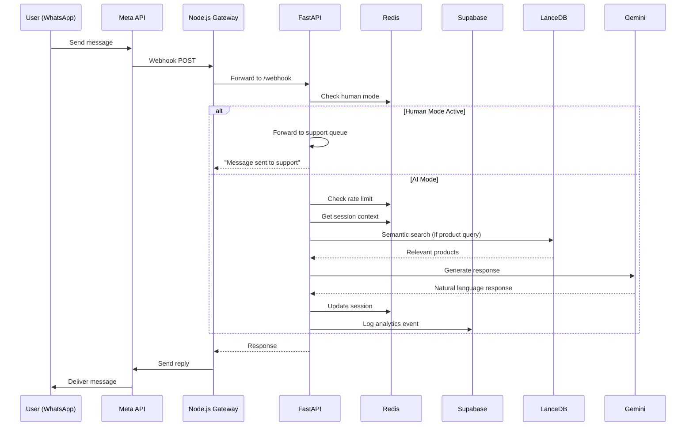
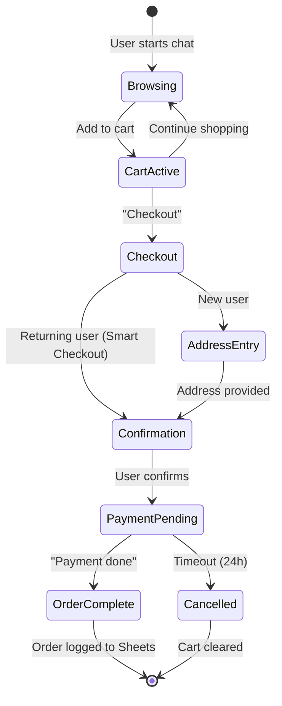

# 🏗️ Architecture Deep-Dive

> A technical explanation of **why** we built SmartShop the way we did.

---

## Table of Contents

1. [System Overview](#system-overview)
2. [Technology Decisions](#technology-decisions)
3. [Data Flow](#data-flow)
4. [Component Details](#component-details)
5. [Scalability Considerations](#scalability-considerations)

---

## System Overview

SmartShop follows a **3-tier architecture** with clear separation of concerns:

```
┌────────────────────────────────────────────────────────────────────────────┐
│                              PRESENTATION LAYER                             │
├──────────────────────────┬──────────────────────────┬──────────────────────┤
│     WhatsApp Client      │    Streamlit Dashboard    │   Future: Web App   │
└────────────┬─────────────┴────────────┬─────────────┴──────────────────────┘
             │                          │
             ▼                          ▼
┌────────────────────────────────────────────────────────────────────────────┐
│                              GATEWAY LAYER                                  │
├────────────────────────────────────────────────────────────────────────────┤
│  Node.js WhatsApp Bridge (whatsapp-web.js / Meta Cloud API)                │
│  - Message normalization                                                    │
│  - Media handling                                                           │
│  - Rate limit buffering                                                     │
└────────────────────────────────────────────────────────────────────────────┘
             │
             ▼
┌────────────────────────────────────────────────────────────────────────────┐
│                              APPLICATION LAYER                              │
├────────────────────────────────────────────────────────────────────────────┤
│  FastAPI Backend                                                            │
│  ┌──────────────┬──────────────┬──────────────┬──────────────────────────┐ │
│  │   Handlers   │   Services   │     RAG      │     Middleware           │ │
│  │ • Cart       │ • Analytics  │ • Embedding  │ • Error Handler          │ │
│  │ • Checkout   │ • Recommend  │ • LanceDB    │ • Rate Limiter           │ │
│  │ • Product    │ • Support    │ • Reranking  │ • Auth (future)          │ │
│  │ • Tracking   │ • Sheets     │              │                          │ │
│  └──────────────┴──────────────┴──────────────┴──────────────────────────┘ │
└────────────────────────────────────────────────────────────────────────────┘
             │
             ▼
┌────────────────────────────────────────────────────────────────────────────┐
│                              DATA LAYER                                     │
├──────────────────────────┬──────────────────────────┬──────────────────────┤
│       Supabase           │        LanceDB           │        Redis         │
│   (PostgreSQL)           │    (Vector Store)        │      (Cache)         │
│  • Users                 │  • Product embeddings    │  • Sessions          │
│  • Orders                │  • Search index          │  • Cart cache        │
│  • Products              │  • Similarity search     │  • Rate limits       │
│  • Analytics             │                          │  • Human mode        │
└──────────────────────────┴──────────────────────────┴──────────────────────┘
```

---

## Technology Decisions

### 1. FastAPI over Flask

**Decision**: FastAPI as the core backend framework.

| Criteria      | Flask                       | FastAPI                | Winner     |
| ------------- | --------------------------- | ---------------------- | ---------- |
| Async Support | Requires extensions (Quart) | Native async/await     | ✅ FastAPI |
| Validation    | Manual or WTForms           | Pydantic built-in      | ✅ FastAPI |
| API Docs      | Swagger via extension       | Auto-generated OpenAPI | ✅ FastAPI |
| Type Safety   | None                        | Full type hints        | ✅ FastAPI |
| Performance   | ~1000 req/s                 | ~3000 req/s            | ✅ FastAPI |

**Why it matters for WhatsApp bots:**

- WhatsApp webhooks require <3 second response time
- Async allows us to send quick ack, then process in background
- Pydantic validates Meta's webhook payloads automatically

```python
# FastAPI's BackgroundTasks = perfect for WhatsApp
@app.post("/webhook")
async def webhook(request: Request, background_tasks: BackgroundTasks):
    body = await request.json()
    background_tasks.add_task(process_message, body)  # Non-blocking
    return Response(status_code=200)  # Immediate response
```

---

### 2. LanceDB over Pinecone/Chroma

**Decision**: LanceDB for vector search.

| Criteria   | Pinecone          | Chroma       | LanceDB       | Winner     |
| ---------- | ----------------- | ------------ | ------------- | ---------- |
| Hosting    | Managed only      | Self-hosted  | Embedded      | ✅ LanceDB |
| Cold Start | 0ms               | ~500ms       | 0ms           | Tie        |
| Cost       | $70/mo minimum    | Free         | Free          | ✅ LanceDB |
| Setup      | API keys, regions | pip install  | pip install   | ✅ LanceDB |
| Scale      | ∞                 | ~10M vectors | ~100M vectors | Pinecone   |

**Why LanceDB for an e-commerce bot:**

1. **Zero Configuration**: Works out of the box, no API keys
2. **Embedded**: Runs in-process, no network latency
3. **Cost**: Free for our scale (~1000 products)
4. **Persistence**: Automatic disk persistence, survives restarts

```python
# LanceDB is literally 3 lines
import lancedb
db = lancedb.connect("./data/lancedb")
results = db.open_table("products").search(query_vector).limit(5).to_list()
```

**When to switch to Pinecone:**

- > 100K products
- Need managed backups
- Multi-region requirements

---

### 3. Supabase over SQLite/Raw Postgres

**Decision**: Supabase (managed PostgreSQL) for primary database.

| Criteria    | SQLite        | Raw Postgres  | Supabase    | Winner            |
| ----------- | ------------- | ------------- | ----------- | ----------------- |
| Concurrency | Single writer | ∞             | ∞           | Postgres/Supabase |
| Setup       | None          | Complex       | 1-click     | ✅ Supabase       |
| Auth        | None          | Manual        | Built-in    | ✅ Supabase       |
| Real-time   | None          | Trigger setup | Built-in    | ✅ Supabase       |
| Cost        | Free          | $5-50/mo      | Free tier   | ✅ Supabase       |
| RLS         | None          | Manual        | Declarative | ✅ Supabase       |

**Why Supabase:**

1. **Managed**: No database administration
2. **Real-time**: Live order updates in dashboard via websockets
3. **Row Level Security**: Phone-based access control
4. **Generous Free Tier**: 500MB storage, 2GB bandwidth

```python
# Supabase's async client is clean
from supabase import create_client, Client

supabase: Client = create_client(url, key)
orders = await supabase.table("orders").select("*").eq("phone", phone).execute()
```

---

### 4. Redis for Sessions, Not Postgres

**Decision**: Redis for ephemeral state (sessions, carts, rate limits).

**The Rule**:

- **Redis**: Data that can be lost (sessions, cache, rate limits)
- **Supabase**: Data that must persist (orders, users, products)

| Use Case         | Why Redis               | TTL      |
| ---------------- | ----------------------- | -------- |
| Shopping Cart    | Fast reads, can rebuild | 24 hours |
| User Session     | Needs atomic ops        | 30 mins  |
| Rate Limits      | Counter operations      | 1 minute |
| Human Mode Flag  | Quick checks            | 1 hour   |
| Idempotency Keys | Deduplication           | 24 hours |

```python
# Redis atomic operations prevent race conditions
async def add_to_cart(phone: str, product_id: str):
    key = f"cart:{phone}"
    await redis.hincrby(key, product_id, 1)  # Atomic increment
    await redis.expire(key, 86400)  # 24h TTL
```

---

### 5. Google Gemini over GPT-4/Claude

**Decision**: Gemini 1.5 Flash for LLM responses.

| Criteria         | GPT-4  | Claude 3 | Gemini Flash | Winner    |
| ---------------- | ------ | -------- | ------------ | --------- |
| Cost (1M tokens) | $30    | $15      | $0.35        | ✅ Gemini |
| Speed (TTFT)     | ~800ms | ~600ms   | ~200ms       | ✅ Gemini |
| Context Window   | 128K   | 200K     | 1M           | ✅ Gemini |
| JSON Mode        | Yes    | Yes      | Yes          | Tie       |
| Availability     | High   | High     | High         | Tie       |

**Why Gemini for WhatsApp:**

1. **Cost**: 100x cheaper than GPT-4 (critical for high-volume chat)
2. **Speed**: Faster first token = better user experience
3. **Context Window**: 1M tokens = can include full product catalog

```python
# Gemini is fast enough for real-time chat
model = genai.GenerativeModel('gemini-1.5-flash')
response = await model.generate_content_async(prompt)
# Average response time: 200-400ms
```

---

### 6. Sentence Transformers over OpenAI Embeddings

**Decision**: Local embeddings with `all-MiniLM-L6-v2`.

| Criteria | OpenAI              | Sentence Transformers | Winner   |
| -------- | ------------------- | --------------------- | -------- |
| Cost     | $0.0001/1K tokens   | Free                  | ✅ Local |
| Latency  | ~200ms API call     | ~10ms local           | ✅ Local |
| Privacy  | Data sent to OpenAI | Data stays local      | ✅ Local |
| Quality  | Excellent           | Very Good             | OpenAI   |
| Offline  | No                  | Yes                   | ✅ Local |

**Trade-off**: Slightly lower quality for zero cost and privacy.

```python
from sentence_transformers import SentenceTransformer
model = SentenceTransformer('all-MiniLM-L6-v2')
embedding = model.encode("wireless headphones")  # 384-dim vector, 10ms
```

---

## Data Flow

### Message Processing Flow



### Order Flow



---

## Component Details

### Intent Detection

We use a **rule-based + LLM fallback** approach:

```python
# 1. Fast keyword matching (0ms)
TRACK_KEYWORDS = ["track", "where is my order", "order status"]
SUPPORT_KEYWORDS = ["support", "human", "agent", "help me"]

# 2. Regex patterns for structured intents
ADD_PATTERN = r"add\s+(\d+)?\s*(.+)"
REMOVE_PATTERN = r"remove\s+(.+)"

# 3. LLM fallback for complex queries (200ms)
if not intent_matched:
    intent = await llm.classify_intent(message)
```

### Error Handling Strategy

We categorize errors and respond appropriately:

| Error Type       | User Message                                    | Action              |
| ---------------- | ----------------------------------------------- | ------------------- |
| `REDIS_ERROR`    | "Let me try that again..."                      | Retry 1x            |
| `DATABASE_ERROR` | "I'm having trouble. Try again soon."           | Log, alert          |
| `LLM_TIMEOUT`    | "I'm thinking... one moment!"                   | Use cached response |
| `RATE_LIMIT`     | "Slow down! Wait 60 seconds."                   | Block temporarily   |
| `UNKNOWN`        | "Something went wrong. Say 'support' for help." | Escalate            |

```python
@safe_handler  # Decorator catches all exceptions
async def handle_message(phone: str, message: str):
    # ... handler code
```

---

## Scalability Considerations

### Current Limits (Single Server)

| Resource         | Limit | Bottleneck         |
| ---------------- | ----- | ------------------ |
| Concurrent Users | ~500  | Redis connections  |
| Messages/sec     | ~100  | LLM API rate       |
| Products         | ~50K  | LanceDB in-memory  |
| Orders/day       | ~10K  | Supabase free tier |

### Scaling Path

```
Phase 1 (Current): Single Server
├── t2.micro EC2, 1GB RAM
├── ~100 msgs/sec
└── ~500 concurrent users

Phase 2 (Medium): Horizontal
├── 2x t2.small behind ALB
├── Redis Cluster
├── ~500 msgs/sec
└── ~2000 concurrent users

Phase 3 (Large): Full Scale
├── ECS/Fargate auto-scaling
├── Pinecone for vectors
├── Supabase Pro
├── ~5000 msgs/sec
└── ~50K concurrent users
```

### What Would Break First

1. **LanceDB Memory**: At ~50K products, switch to Pinecone
2. **Redis Connections**: At ~1000 concurrent, add Redis Cluster
3. **Supabase Limits**: At ~10K orders/day, upgrade to Pro
4. **LLM Rate Limits**: At ~1000 msgs/min, add request queue

---

## Appendix: File Structure Explained

```
backend/
├── api/
│   └── whatsapp_routes.py    # Single entry point for all WhatsApp webhooks
├── handlers/                  # One handler per intent category
│   ├── cart_handler.py       # Add, remove, view cart
│   ├── checkout_handler.py   # Order flow, payment
│   ├── product_handler.py    # Search, browse products
│   └── tracking_handler.py   # Order status queries
├── services/                  # Reusable business logic
│   ├── analytics_service.py  # Event tracking (fire-and-forget)
│   ├── recommendation_service.py  # Cross-sell suggestions
│   ├── support_service.py    # Human handoff logic
│   └── sheets_service.py     # Google Sheets sync
├── rag/                       # Search engine components
│   ├── search_engine.py      # LanceDB + embedding
│   └── embedding_service.py  # Sentence Transformers
├── middleware/
│   └── error_handler.py      # Global exception handling
└── database/
    ├── supabase_client.py    # Async Supabase client
    └── schema.sql            # Database migrations
```

---

<div align="center">

**[← Back to README](../README.md)** | **[Security Considerations →](../SECURITY.md)**

</div>
